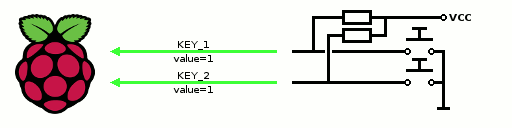

# remithefox/php-gpio
PHP library which provide class for GPIO

## Installation

### Composer

```bash
$ composer require remithefox/php-gpio
```

## Usage

At first make sure user has permission to use GPIO. Standard Raspbian configuration users in group GPIO have that permission.

### Pin

Create `RemiTheFox\PhpGPIO\Pin` object to open GPIO pin.

Constructor parameters:

no. | type     | name           | required | default | description
----|----------|----------------|----------|---------|-
1   | integer  | `$pinNumber`   | Yes      | (none)  | BCM pin number
2   | string   | `$direction`   | No       | `'in'`  | pin direction `'in'` or `'out'`
3   | bool     | `$force`       | No       | `false` | forces when pin is occupied
4   | int      | `$timeout`     | No       | `10000` | export timeout in microseconds
5   | bool     | `$autorelease` | No       | `true`  | pin will be released after unset or lost the last reference
6   | string   | `$devicePath`  | No       | `'/sys/class/gpio/'` | device path (almost sure you should leave it default, it's for testing)

Constructor throws:

- [`InvalidDirection`](#InvalidDirection) when direction will be different than `'in'` or `'out'`,
- [`GpioNotFound`](#GpioNotFound) when GPIO is not found in system,
- [`PermissionDenied`](#PermissionDenied) when user does not have permission to use GPIO,
- [`PinOccupied`](#PinOccupied) when chosen pin is occupied (is exported) and `$force` flag is `false`,
- [`ExportTimeout`](#ExportTimeout) when GPIO pin export time limit will be exceeded,
- [`IOError`](#IOError) on any input/output error.

Example:

```php
use RemiTheFox\PhpGPIO\Pin;
use RemiTheFox\PhpGPIO\GpioElementInterface;

$pin = new Pin(4, GpioElementInterface::DIRECTION_OUT);
```

#### Reading

To read pin state use `getValue()` method.

Method `getValue()` can throw:

- [`IOError`](#IOError) on any input/output error.

Method `getValue()` returns `true` for logic high and `false` for logic low.

Example:

```php
$input = $pin->getValue();
```



#### Writing

To write pin state (in output mode) use `setValue()` method.

`setValue()` method parameters:

no. | type | name     | required | default | description
----|------|----------|----------|---------|-
1   | bool | `$value` | Yes      | (none)  | new value

Method `setValue()` throws:

- [`WriteOnInputMode`](#WriteOnInputMode) when trying to write value on GPIO element on input mode,
- [`IOError`](#IOError) on any input/output error.

Method `setValue()` returns `$this`

Example:

```php
$pin->setValue(true);
```


#### Changing direction

To change pin direction use `setDirection()` method.

`setDirection()` method parameters:

no. | type     | name         | required | default | description
----|----------|--------------|----------|---------|-
1   | string   | `$direction` | Yes      | (none)  | new pin direction `'in'` or `'out'`


Method `setDirection()` throws:

- [`InvalidDirection`](#InvalidDirection) when direction will be different than `'in'` or `'out'`.
- [`IOError`](#IOError) on any input/output error.

Method `setDirection()` returns `$this`

Example:

```php
$pin->setDirection(GpioElementInterface::DIRECTION_OUT);
```

**Note:** Please be careful with changing directions. If both devices are in output mode at the same time, it can short circuit and cause damages.
I highly recommend avoiding direction changes. Otherwise make sure it's not possible for both devices to be in output mode at the same time.

#### Checking direction

To check pin direction use one of following methods: `getDirection()`, `isInput()`, `isOutput()`

method           | type     | input mode result | output mode result
-----------------|----------|-------------------|-
`getDirection()` | `string` | `'in'`            | `'out'`
`isInput()`      | `bool`   |`true`             | `false`
`isOutput()`     | `bool`   |`false`            | `true`

### ParallelDataBus

To send data by parallel bus you can use `RemiTheFox\PhpGPIO\ParallelDataBus` object.

Constructor parameters:

no. | type           | name         | required | default | description
----|----------------|--------------|----------|---------|-
1   | PinInterface[] | `$pins`      | Yes      | (none)  | Array of pins
2   | string         | `$direction` | No       | `'in'`  | pin direction `'in'` or `'out'`

Constructor throws:

- [`PinArrayExpected`](#PinArrayExpected) when `ParallelDataBus` gets something other than array of pins in first parameter of constructor,
- [`InvalidDirection`](#InvalidDirection) when direction will be different than `'in'` or `'out'`.
- [`IOError`](#IOError) on any input/output error.

Example:

```php
use RemiTheFox\PhpGPIO\ParallelDataBus;
use RemiTheFox\PhpGPIO\Pin;
use RemiTheFox\PhpGPIO\GpioElementInterface;

$pinNumbers = [2, 1, 3, 7];
$pins = [];
foreach ($pinNumbers as $pinNumber) {
    $pins[] = new Pin($pinNumber);
}
$bus = new ParallelDataBus($pins, GpioElementInterface::DIRECTION_IN);
```

Yup it's too long. You can use [factory method](#createParallelDataBus) to make it short.

#### Reading

To read value on bus use `getValue()` method.

Method `getValue()` throws:

- [`IOError`](#IOError) on any input/output error.

Method `getValue()` returns unsigned integer value in range from 0 to 2<sup>n</sup>-1

Example:

```php
$input = $pin->getValue();
```


#### Writing

To write bus value (in output mode) use `setValue()` method.

`setValue()` method parameters:

no. | type | name     | required | default | description
----|------|----------|----------|---------|-
1   | int  | `$value` | Yes      | (none)  | new value (value should be in range from 0 to 2<sup>n</sup>-1)

Method `setValue()` throws:

- [`WriteOnInputMode`](#WriteOnInputMode) when trying to write value on GPIO element on input mode,
- [`OutOfRange`](#OutOfRange) when trying to write value out of range from 0 to 2<sup>n</sup>-1,
- [`IOError`](#IOError) on any input/output error.

Method `setValue()` returns `$this`

Example:

```php
$pin->setValue(true);
```


#### Changing direction

To change bus direction use `setDirection()` method.
This method changes direction of all pins.

`setDirection()` method parameters:

no. | type     | name         | required | default | description
----|----------|--------------|----------|---------|-
1   | string   | `$direction` | Yes      | (none)  | new pin direction `'in'` or `'out'`


Method `setDirection()` throws:

- [`InvalidDirection`](#InvalidDirection) when direction will be different than `'in'` or `'out'`.
- [`IOError`](#IOError) on any input/output error.

Method `setDirection()` returns `$this`

Example:

```php
$pin->setDirection(GpioElementInterface::DIRECTION_OUT);
```

**Note:** Please be careful with changing directions. If both devices are in output mode at the same time, it can short circuit and cause damages.
I highly recommend avoiding direction changes. Otherwise make sure it's not possible for both devices to be in output mode at the same time.

#### Checking direction

To check pin direction use one of following methods: `getDirection()`, `isInput()`, `isOutput()`

method           | type     | input mode result | output mode result
-----------------|----------|-------------------|-
`getDirection()` | `string` | `'in'`            | `'out'`
`isInput()`      | `bool`   |`true`             | `false`
`isOutput()`     | `bool`   |`false`            | `true`

### Factory

#### `createParallelDataBus()`

To create `ParallelDataBus` in the simpler way, you can use method `Factory::createParallelDataBus()`.

no. | type     | name           | required | default              | description
----|----------|----------------|----------|----------------------|-
1   | int[]    | `$pinNumbers`  | Yes      | (none)               | array of BCM pin numbers
2   | string   | `$direction`   | No       | `'in'`               | pin direction `'in'` or `'out'`
3   | bool     | `$force`       | No       | `false`              | forces when pin is occupied
4   | int      | `$timeout`     | No       | `10000`              | export timeout in microseconds
5   | bool     | `$autorelease` | No       | `true`               | pin will be released after unset or lost the last reference
6   | string   | `$devicePath`  | No       | `'/sys/class/gpio/'` | device path (almost sure you should leave it default, it's for testing)

Method `Factory::createParallelDataBus()` throws:

- [`InvalidDirection`](#InvalidDirection) when direction will be different than `'in'` or `'out'`,
- [`GpioNotFound`](#GpioNotFound) when GPIO is not found in system,
- [`PermissionDenied`](#PermissionDenied) when user does not have permission to use GPIO,
- [`PinOccupied`](#PinOccupied) when chosen pin is occupied (is exported) and `$force` flag is `false`,
- [`ExportTimeout`](#ExportTimeout) when GPIO pin export time limit will be exceeded,
- [`IOError`](#IOError) on any input/output error.

Method `Factory::createParallelDataBus()` returns `ParallelDataBus`.

Example:

```php
use RemiTheFox\PhpGPIO\Factory as GpioFactory;
use RemiTheFox\PhpGPIO\GpioElementInterface;

$bus = GpioFactory::createParallelDataBus([2, 1, 3, 7], GpioElementInterface::DIRECTION_IN);
```

### Exceptions

All exceptions are in namespace `RemiTheFox\PhpGPIO\Exception` and extends abstract class `RemiTheFox\PhpGPIO\Exception`.

#### ExportTimeout

`ExportTimeout` will be thrown when GPIO pin export time limit will be exceeded.

#### GpioNotFound

`GpioNotFound` will be thrown when GPIO is not found in system.

#### IOError

`IOError` will be thrown on any input/output error.

#### InvalidDirection

`InvalidDirection` will be thrown when direction will be different than `'in'` or `'out'`.

#### OutOfRange

`OutOfRange` will be thrown when trying to write value out of range from 0 to 2<sup>n</sup>-1 on `ParallelDataBus`.

#### PermissionDenied

`PermissionDenied` will be thrown when user does not have permission to use GPIO.

#### PinArrayExpected

`PinArrayExpected` will be thrown when `ParallelDataBus` gets something other than array of pins in first parameter of constructor.

#### PinOccupied

`PinOccupied` will be thrown when chosen pin is occupied (is exported) and `$force` flag is false.

#### WriteOnInputMode

`WriteOnInputMode` will be thrown when trying to write value on GPIO element on input mode.


long text? ASCII-fox

```text
 /\-/\
(=^w^=)
 )   (
```